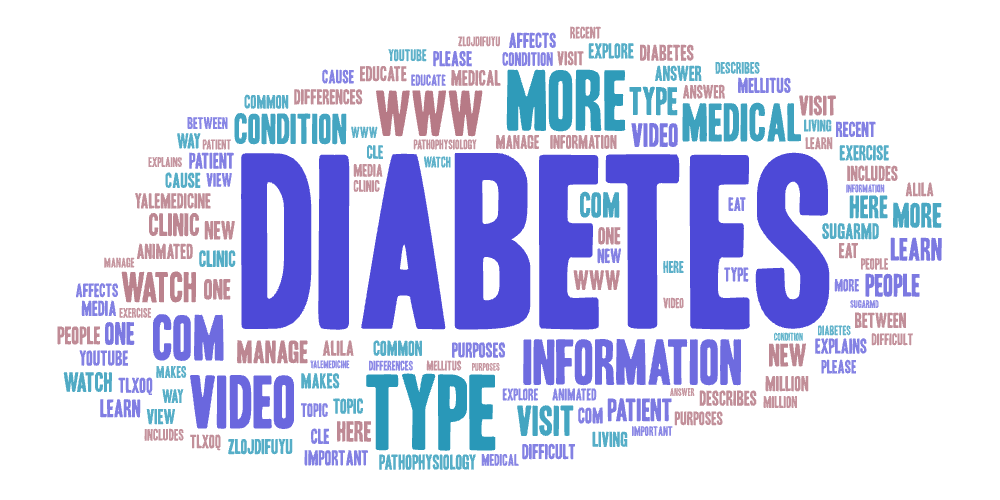
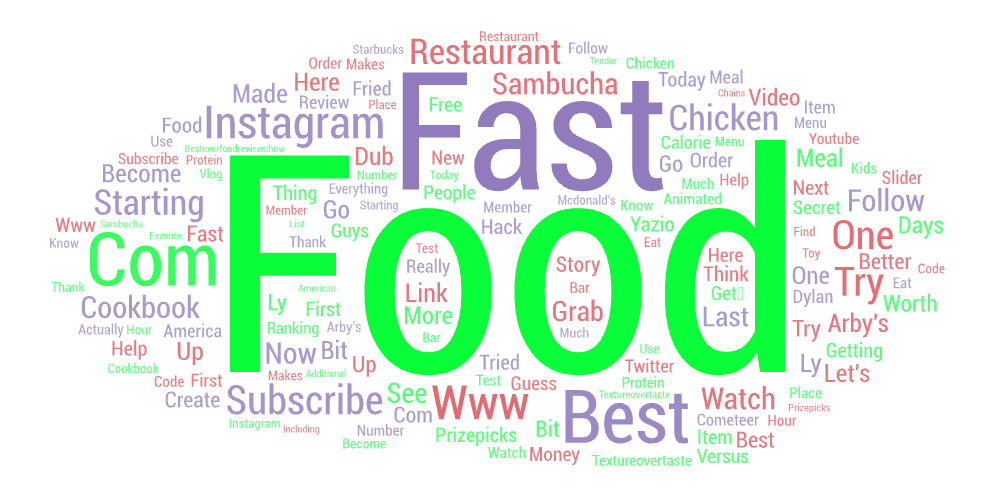
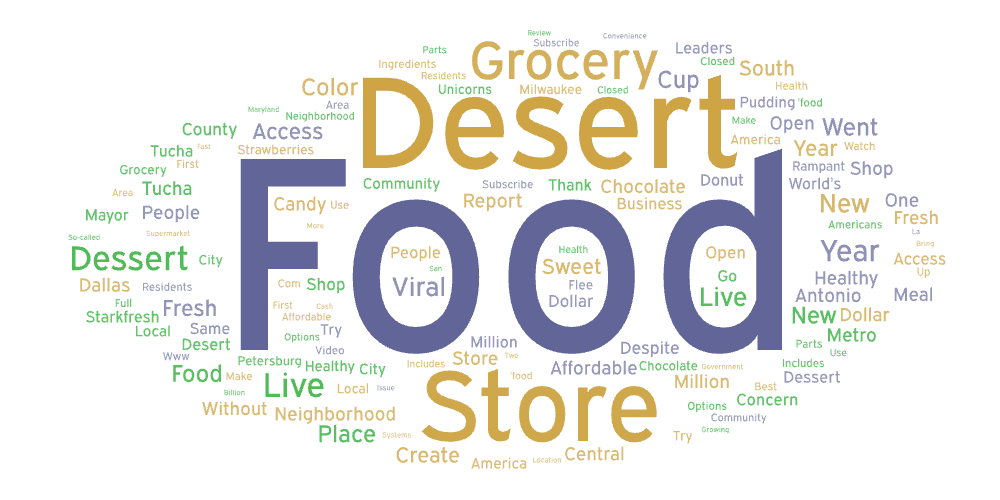

# Geog458Lab2
Author: Jiacheng Yuan
In this lab, I researched three different terms: food desert, fast food and diabetes. The share the same topic: Food accessibility and people's health. when search the three different terms, I inputed mutilple parameters to make sure the search result is optimizes. For the food desert, I used parameters "food desert" "desert of food". For the fast food, I used parameters "fast food" "fast-food". For the diabetes, I used "diabetes" "Diabetic ketoacidosis". I used these three different terms to generate three different cloud 

I want to make this comparison because I want to see how the people are talking about these three terms and how their wordcloud are similar to each other. If there are obvious overlap between these 3 wordclouds, that means food desert and fast food can have a corelation with diabetes. Thats what i want to argue: the government should working on programs that eliminate food desert to improve the overall health of people in the U.S. From the word clouds, the words that related to the keywords can be used and analysed to find solutions to these problems. 

## Word Cloud – Diabetes

## Word Cloud – Fast Food

## Word Cloud – Food Desert

Above are the 3 word clouds I made. From the Food desert wordcloud, there is a big "Grocery store", that means food desert is created becasue of lack of geocery stores in a certian area,thats also the defination of food desert. You can also see words like "sweet" "dessert" "candy", that may indicates that people living in food desert may have to consume sweet food to gain high calories for survive. Sweet food can cause diabetes. From the fast food wordcloud, i surprising find no similarity with the other 2 wordclouds, the frequent words are 'like' 'subscript' ' more' 'best' and the name of brands of fast food. Most video about fast food are just reviewing and share experience of eating fast food, few have analyse or criticize the impact of health. Thats because fast food is very commomly accpeted and many people like it. From the diabetes wordcloud, the frequent words are 'treatment' 'infomation' 'video', that means many people are searching video that cure or relief the symptoms of diabetes, that reflects that diabetes is a commom disease and so many peoples with diabetes are searching for help online. 

